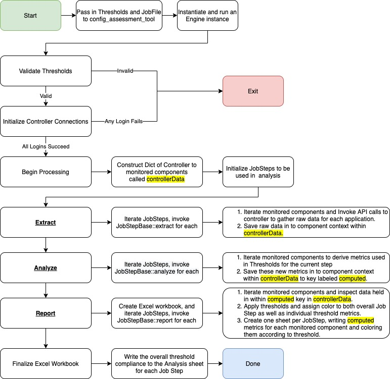
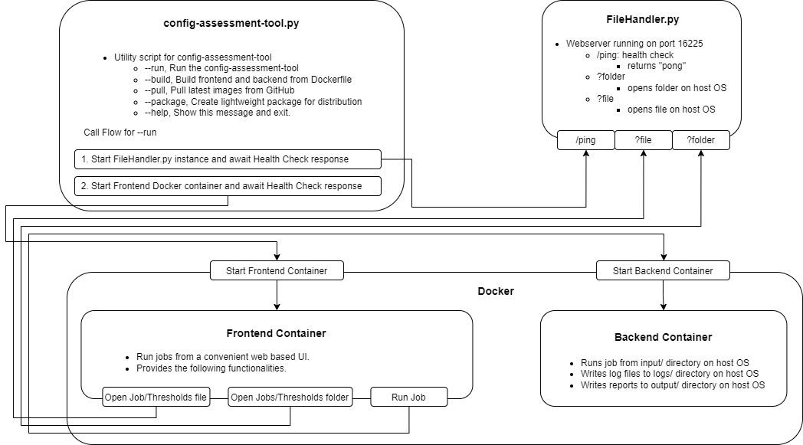

[](https://github.com/psf/black)


# config-assessment-tool

This project aims to provide a single source of truth for performing AppDynamics Health Checks.

## Usage

There are four options to run the tool:

1. [UI Method](https://github.com/Appdynamics/config-assessment-tool#ui-method)
   - Run jobs from a convenient web based UI
   - Recommended for most users
2. [Platform executable](https://github.com/Appdynamics/config-assessment-tool#platform-executable)
   - An OS specific bundle if you are not using Docker and Python
   - Recommended for users unable to use Docker
3. [Directly via Docker](https://github.com/Appdynamics/config-assessment-tool#directly-via-docker)
   - The backend container can be run manually from the command line
   - Recommended for users with Docker who do not want to use the UI
4. [From Source](https://github.com/Appdynamics/config-assessment-tool#directly-via-docker)
   - Manually install dependencies and run the `backend.py` script directly
   - Recommended for users who want to build the tool from source

### Important step for running on Windows (Ignore this step if using method 2 or 4 above)

Docker on Windows requires manually sharing the `/input`, `/output`, and `/logs` directories with the container. If you do not follow this step, you will get the following error when trying to run the
container: `DockerException Filesharing has been cancelled`. Take a look at the documentation [here](https://docs.docker.com/desktop/windows/) for more information.

### Expected Permissions
The tool expects ONLY the following permissions to be given:

- Account Owner (Default)
- Administrator (Default)
- Analytics Administrator (Default)

### UI method

Obtain frontend and backend Docker images via:

1. Download or clone the latest `Source Code.zip` from [here](https://github.com/Appdynamics/config-assessment-tool/releases)
2. `cd config-assessment-tool`
3. `python3 bin/config-assessment-tool.py --run`
4. Your browser will automatically open `http://localhost:8501`


Add new Jobs or Thresholds to `config_assessment_tool/resources/jobs` and `config_assessment_tool/resources/thresholds` respectively.

Refresh the page to see the Jobs and Thresholds appear.

### Platform executable

Use this method if you are not able to use Docker or Python in your target deployment environment. Currently, platform bundles are available for Windows and Linux only.

1. Download and unzip (or untar in case of linux) the latest `config-assessment-tool-<OS>-<version>.<zip|tgz>` from [here](https://github.com/Appdynamics/config-assessment-tool/releases) where OS is one of windows/linux depending on your target host and version is the config tool release version
2. cd into the expanded directory and edit `input/jobs/DefaultJobs.json` to match your target controller. You may also create a job file of your own. e.g. `input/jobs/<job-file-name>.json`
3. Run the executable for your target platform located at the root of expanded directory:
1. For Linux: using a command line shell/terminal run `./config-assessment-tool` if using DefaultJob.json or `./config-assessment-tool -j <job-file-name>` if you created your own job file
2. For Windows: using a CMD or PowerShell terminal run `.\config-assessment-tool.exe` if using DefaultJob.json or `./config-assessment-tool.exe -j <job-file-name>` if you created your own job file

This method of running the tool currently does not support using the UI. You may only use command line instructions as outlined above. You can change the settings by editing the included configuration files directly.  You may ignore any other files/libraries in the bundle. The configuration files and their directory locations for you to edit are listed below.

In some installations, specially on-prem controllers, *certificate verification failed* errors may occur when the tool attempts to connect to the controller URL. This might be due to certificate issues. Set the value of *sslVerify* option to false in the input/jobs/*.json file as the first attempt to resolve this error.

```

config-assessment-tool-<OS>-<version>/
├── config-assessment-tool          # executable file to run. For Windows this will be config-assessment-tool.exe
├── input
│   ├── jobs
│   │   └── DefaultJob.json         # default job used if no job file flag used with your own custom job file(-j). Your Controller(s) connection settings.
│   └── thresholds
│       └── DefaultThresholds.json  # default threshold file used if no custom threshhold file flag(-t) is used with your own custom file 
│   ├── ....
│   │
└── ...
    └── ...

```

### Directly via Docker

You can start the backend container with the following command:

Unix

```
docker run \
--name "config-assessment-tool-backend" \
-v "$(pwd)/logs":/logs \
-v "$(pwd)/output":/output \
-v "$(pwd)/input":/input \
-e HOST_ROOT="$(pwd)" \
-p 8501:8501 \
--rm \
ghcr.io/appdynamics/config-assessment-tool-backend-{platform}:{tag} -j DefaultJob -t DefaultThresholds
```

Windows

```
docker run `
--name "config-assessment-tool-backend" `
-v $pwd/logs:/logs `
-v $pwd/output:/output `
-v $pwd/input:/input `
-e HOST_ROOT=$pwd `
-p 8501:8501 `
--rm `
ghcr.io/appdynamics/config-assessment-tool-backend-{platform}:{tag} -j DefaultJob -t DefaultThresholds
```

### From Source

#### Steps to run

Required

1. `git clone https://github.com/Appdynamics/config-assessment-tool.git`
2. `cd config-assessment-tool`
3. `pipenv install`
4. `pipenv shell`
5. `python3 backend/backend.py -j DefaultJob -t DefaultThresholds`

```
Usage: backend.py [OPTIONS]

Options:
  -j, --job-file TEXT
  -t, --thresholds-file TEXT
  -d, --debug
  -c, --concurrent-connections INTEGER
  --help                          Show this message and exit.
```

Options `--job-file` and `--thresholds-file` will default to `DefaultJob` and `DefaultThresholds` respectively.

All Job and Threshold files must be contained in `config_assessment_tool/resources/jobs` and `config_assessment_tool/resources/thresholds` respectively. They are to be referenced by name file name (
excluding .json), not full path.

The frontend can be invoked by navigating to `config_assessment_tool/frontend` and invoking `streamlit run frontend.py`

## Output

This program will create the following files in the `out` directory.

- `{jobName}-MaturityAssessment-apm.xlsx`
  - MaturityAssessment report for APM
- `{jobName}-MaturityAssessment-brum.xlsx`
  - MaturityAssessment report for BRUM
- `{jobName}-MaturityAssessment-mrum.xlsx`
  - MaturityAssessment report for MRUM
- `{jobName}-AgentMatrix.xlsx`
  - Details agent versions rolled up by application
  - Lists the details of individual without any rollup
- `{jobName}-CustomMetrics.xlsx`
  - Lists which applications are leveraging Custom Extensions
- `{jobName}-License.xlsx`
  - Export of the License Usage page in the Controller
- `{jobName}-MaturityAssessmentRaw-apm.xlsx`
  - Raw metrics which go into MaturityAssessment for APM report
- `{jobName}-MaturityAssessmentRaw-brum.xlsx`
  - Raw metrics which go into MaturityAssessment for BRUM report
- `{jobName}-MaturityAssessmentRaw-mrum.xlsx`
  - Raw metrics which go into MaturityAssessment for MRUM report
- `controllerData.json`
  - Contains all raw data used in analysis.
- `info.json`
  - Contains information on previous job execution.

## Program Architecture

### Backend



### Frontend



## Proxy Support

Support for plain HTTP proxies and HTTP proxies that can be upgraded to HTTPS via the HTTP CONNECT method is provided by enabling the `useProxy` flag in a given job file. Enabling this flag will cause
the backend to use the proxy specified from environment variables: HTTP_PROXY, HTTPS_PROXY, WS_PROXY or WSS_PROXY (all are case insensitive). Proxy credentials are given from ~/.netrc file if present.
See aiohttp.ClientSession [documentation](https://docs.aiohttp.org/en/stable/client_advanced.html#proxy-support) for more details.

## JobFile Settings

[DefaultJob.json](https://github.com/Appdynamics/config-assessment-tool/blob/master/input/jobs/DefaultJob.json) defines a number of optional configurations.

- verifySsl
  - enabled by default, disable it to disable SSL cert checking (equivalent to `curl -k`)
- useProxy
  - As defined above under [Proxy Support](https://github.com/Appdynamics/config-assessment-tool#proxy-support), enable this to use a configured proxy
- applicationFilter
  - Three filters are available, one for `apm`, `mrum`, and `brum`
  - The filter value accepts any valid regex, set to `.*` by default
  - Set the value to null to filter out all applications for the set type
- timeRangeMins
  - Configure the data pull time range, by default set to 1 day (1440 mins)
- pwd
  - Your password will be automatically encrypted to base64 when it is persisted to disk
  - If your password is not entered as base64, it will be automatically converted

## Requirements

- Python 3.5 or above if running with `bin/config-assessment-tool.py`
- Python 3.9 or above if running from source
- [Docker](https://www.docker.com/products/docker-desktop)
- None if running using Platform executable method. Tested on most Linux distributions and Windows 10/11

## Limitations

- Data Collectors
  - The API to directly find snapshots containing data collectors of type `Session Key` or `HTTP Header` does not work.
  - The API does however work for `Business Data` (POJO match rule), `HTTP Parameter`, and `Cookie` types.
  - As far as I can tell this is a product limitation, the transaction snapshot filtering UI does not even have an option for `Session Key` or `HTTP Header`.
  - The only way to check for `Session Key` or `HTTP Header` data collector existence within snapshots would be to inspect ALL snapshots (prohibitively time intensive).
  - As a workaround, we will assume any `Session Key` or `HTTP Header` data collectors are present in snapshots.

## Support

Please email bnagallo@cisco.com for any issues and attach debug logs.

Debug logs can be taken by either:

- checking the `debug` checkbox in the UI
- running the backend with the `--debug` or `-d` flag