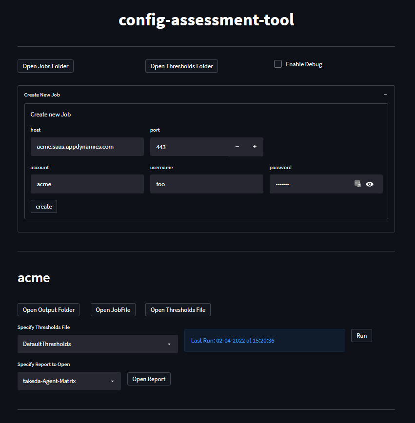

[](https://github.com/psf/black)


# config-assessment-tool

This project aims to provide a single source of truth for performing AppDynamics Health Checks.

## Usage

There are three options to run the tool:

1. The config-assessment-tool provides a frontend UI to view/run jobs.
2. The container can be run manually from the command line.
3. Build and run the `backend.py` script directly.

### Important step for running on windows

Docker on Windows requires manually sharing the `/input`, `/output`, and `/logs` directories with the container. If you do not follow this step, you will get the following error when trying to run the
container: `DockerException Filesharing has been cancelled`. Take a look at the documentation [`here`](https://docs.docker.com/desktop/windows/) for more information.

### UI method

Obtain frontend and backend Docker images via:

1. Either build from source with `python bin/config-assessment-tool.py --build` or pull from ghrc with `python bin/config-assessment-tool.py --pull`
3. Run with `python bin/config-assessment-tool.py --run`
4. Navigate to `http://localhost:8501`



Add new Jobs or Thresholds to `config_assessment_tool/resources/jobs` and `config_assessment_tool/resources/thresholds` respectively.

Refresh the page to see the Jobs and Thresholds appear.

### Directly via Docker

You can start the backend container with the following command:

Unix

```
docker run \
--name "config-assessment-tool-backend" \
-v "$(pwd)/logs":/logs \
-v "$(pwd)/output":/output \
-v "$(pwd)/input":/input \
-e HOST_ROOT="$(pwd)" \
-p 8501:8501 \
--rm \
ghcr.io/appdynamics/config-assessment-tool-backend:latest -j acme -t DefaultThresholds
```

Windows

```
docker run `
--name "config-assessment-tool-backend" `
-v $pwd/logs:/logs `
-v $pwd/output:/output `
-v $pwd/input:/input `
-e HOST_ROOT=$pwd `
-p 8501:8501 `
--rm `
ghcr.io/appdynamics/config-assessment-tool-backend:latest -j acme -t DefaultThresholds
```

### From Source

The backend can be invoked via `python backend.py`.

```
Usage: backend.py [OPTIONS]

Options:
  -j, --job-file FILENAME
  -t, --thresholds-file FILENAME
  --help Show this message and exit.
```

Options `--job-file` and `--thresholds-file` will default to `DefaultJob` and `DefaultThresholds` respectively.

All Job and Threshold files must be contained in `config_assessment_tool/resources/jobs` and `config_assessment_tool/resources/thresholds` respectively. They are to be referenced by name file name (
excluding .json), not full path.

The frontend can be invoked by navigating to `config_assessment_tool/frontend` and invoking `streamlit run frontend.py`

## Output

This program will generate `{jobName}.xlsx` in the `out` directory containing the Health Check analysis.

## Program Architecture

### Backend


## Requirements

- Python 3.5 or above
- Docker

## Limitations

- Data Collectors
    - The API to directly find snapshots containing data collectors of type `Session Key` or `HTTP Header` does not work.
    - The API does however work for `Business Data` (POJO match rule), `HTTP Parameter`, and `Cookie` types.
    - As far as I can tell this is a product limitation, the transaction snapshot filtering UI does not even have an option for `Session Key` or `HTTP Header`.
    - The only way to check for `Session Key` or `HTTP Header` data collector existence within snapshots would be to inspect ALL snapshots (prohibitively time intensive).
    - As a workaround, we will assume any `Session Key` or `HTTP Header` data collectors are present in snapshots.

## Support

Please email bradley.hjelmar@appdynamics.com for any issues.