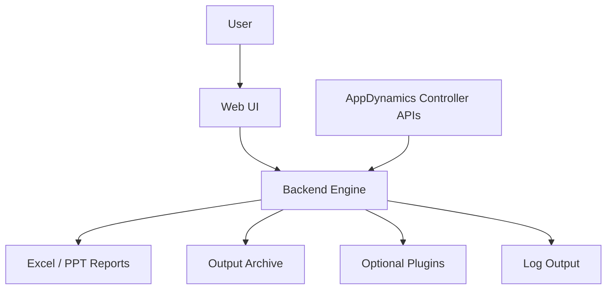
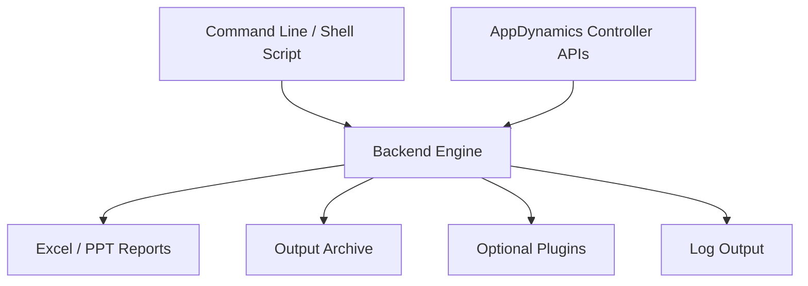

# Tool Overview

This document contains high-level context for the Config Assessment Tool.

# Architecture

This document summarizes the main moving parts of the Config Assessment Tool.

## General Description

The Configuration Assessment Tool, also known as `config-assessment-tool` on GitHub, is an open-source project developed by AppDynamics engineers. Its purpose is to evaluate the configuration and quality of instrumentation in applications that are monitored by the AppDynamics Application Performance Monitoring (APM) product suite. The intended audience for this tool is AppDynamics/Cisco customers and AppD/Cisco personnel who assist customers in improving the quality of instrumentation of their applications. The tool is Python-based (3.12) and therefore requires a Python installation unless using the self-contained platform specific executable bundles (Linux, Windows).

Users can run the tool directly from the source or use the docker container (locally built only and not pulled from any repo), or the executable bundle (Windows and Linux bundles) that contain shared libraries or executable files for Python. If users wish to run the code using Docker, they must build the local image on their platform (using the provided Dockerfile) as we do not currently publish platform specific Docker images of the tool into any repositories. Therefore, a Docker engine install is also required for container-based install/build and execution.

If users do not wish to install Python and Docker and are looking for a self-contained executable bundle, we recommend using the latest version of the Linux tar ball or the Windows zip file available on the release page and following the platform executable installation steps.

There are Python packages and library dependencies that are required and pulled from the PyPI package repository when `config-assessment-tool` is installed. These can be examined by following the build-from-source instructions and examining the downloaded packages in your local Python environment.

When `config-assessment-tool` starts, it reads the job file with the customer-provided properties and connects to the AppDynamics controller URL defined in that job file. The controller(s) can be AppDynamics hosted SaaS controllers or customer on-premises installations. The tool also uses the credentials in the job file to authenticate to the controller. Using the generated temporary session token, it uses the AppDynamics Controller REST API to pull various metrics and generate the `output` directory. This directory contains these metrics in the form of various Excel worksheet files, along with other supplemental data files. These are the artifacts used by customers to examine and provide various metrics around how well each of the applications being monitored on the respective controller is performing.

There is no other communication from the tool to any other external services. It solely utilizes the AppDynamics Controller REST API. See the online API documentation for the superset reference for more information.

Consult the links below for the aforementioned references:

- AppDynamics APIs: https://docs.appdynamics.com/appd/22.x/latest/en/extend-appdynamics/appdynamics-apis#AppDynamicsAPIs-apiindex
- Platform executable bundles: https://github.com/Appdynamics/config-assessment-tool/releases
- Job file: https://github.com/Appdynamics/config-assessment-tool/blob/master/input/jobs/DefaultJob.json
- Build from source: https://github.com/Appdynamics/config-assessment-tool#from-source
- `config-assessment-tool` GitHub open source project: https://github.com/Appdynamics/config-assessment-tool
- AppDynamics: https://www.appdynamics.com/
- Docker: https://docs.docker.com/
- PyPI Python package repository: https://pypi.org/

## High-level components

- `frontend/` — Streamlit-based Web UI
- `backend/` — orchestration, controller access, report generation, plugins, and output handling
- `input/` — job and threshold configuration files
- `output/` — generated reports and archives
- `plugins/` — optional plugin extensions

## Web UI flow

## Headless flow

## Key runtime paths

- `frontend/frontend.py` starts the UI
- `backend/backend.py` starts the backend CLI
- `config-assessment-tool.sh` is the main shell wrapper
- `backend/core/Engine.py` orchestrates data collection and report generation

## Related references

- Installation and operations: [`RUNBOOK.md`](RUNBOOK.md)
- Troubleshooting: [`TROUBLESHOOTING.md`](TROUBLESHOOTING.md)

