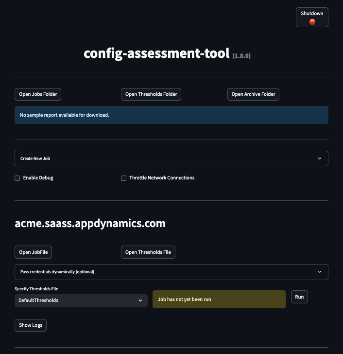

# Runbook

This guide is for operators who need the full set of run options, common commands, and expected outputs.

## Table of Contents
1. [Prerequisites and setup](#prerequisites-and-setup)
2. [Run using docker](#run-using-docker)
3. [Run using Platform Executables](#run-using-platform-executables)
4. [Other ways to run](#other-ways-to-run)
5. [Plugin management](#plugin-management)
6. [Output artifacts](#output-artifacts)
7. [Web UI](#web-ui)

---

## Prerequisites and setup

Get CAT files first:

- Download a platform executable bundle or source archive from the GitHub releases page: `https://github.com/Appdynamics/config-assessment-tool/releases`
- Or clone the repository with Git to work from source:

```bash
git clone https://github.com/Appdynamics/config-assessment-tool.git
cd config-assessment-tool
```

Choose the run path that matches your environment:

- Docker Desktop / Docker Engine for container-based runs
- Python 3.12 and Pipenv for source-based runs
- Platform executable bundle if you do not want to install Python locally

Required local directory layout:

```text
configuration-assessment-tool/
├── input/
│   ├── jobs/
│   └── thresholds/
├── logs/
└── output/
```

Edit `input/jobs/DefaultJob.json` or create your own file under `input/jobs/`.

```json
[
  {
    "host": "acme.saas.appdynamics.com",
    "port": 443,
    "ssl": true,
    "account": "acme",
    "authType": "token",
    "username": "foo",
    "pwd": "<encoded-or-plain-password>",
    "verifySsl": true,
    "useProxy": true,
    "applicationFilter": {
      "apm": ".*",
      "mrum": ".*",
      "brum": ".*"
    },
    "timeRangeMins": 1440
  }
]
```

If `authType` is omitted, the backend defaults to `basic` for backward compatibility.

Authentication options:

- `basic`: controller UI username and password
- `token`: API client name plus temporary access token
- `secret`: API client name plus client secret

Common job settings:

- `verifySsl`: validates TLS certificates; disable only for troubleshooting
- `useProxy`: tells CAT to honor configured proxy environment variables
- `applicationFilter`: regex filters for APM, Browser RUM, and Mobile RUM apps
- `timeRangeMins`: time window for analysis; default is `1440`
- `pwd`: written back in encoded form when the tool persists the file

Expected permissions typically include:

- Account Owner (default)
- Administrator (default)
- Analytics Administrator (default)
- Server Monitoring Administrator (default)

Windows Docker note:

- If you run CAT with Docker Desktop on Windows, make sure your local `input`, `output`, and `logs` directories are shared with Docker.

---

## Run using docker

Use direct Docker commands if you do not want to use the helper script.

```text
Usage: docker run [DOCKER_OPTIONS] <docker-image> [ --ui | ARGS ]

docker container requires you to provide information on where to
look for input jobs as well as output and log directories using
the -v option to mount local directories into the container.

DOCKER_OPTIONS:
  -p 8501:8501                         What port to access the Web UI if using --ui option. Defaults to 8501.
  -v <local input dir>:/app/input      Required. Must contain 'jobs' and 'thresholds' subfolders.
  -v <local output dir>:/app/output    Required. Destination for generated reports and archive dir.
  -v <local logs dir>:/app/logs        Recommended. Where to log job run output.

Example directory structure required:

  configuration-assessment-tool/
  ├── input
  │   ├── jobs
  │   │   └── DefaultJob.json         Job file (can have multiple job files)
  │   └── thresholds
  │       └── DefaultThresholds.json  Default thresholds file is good for most use cases
  ├── logs                            Where CAT logs program output. Optional. Created if not provided
  └── output                          Where all reports are saved. Required. Created if not provided

  --ui              Start the Web UI
  [ARGS]            Start the Backend (Headless) without UI

[ARGS]:
  -j, --job-file <name>                Job file name (default: DefaultJob)
  -t, --thresholds-file <name>         Thresholds file name (default: DefaultThresholds)
  -d, --debug                          Enable debug logging
  -c, --concurrent-connections <n>     Number of concurrent connections
```


### Use Web UI to run

```bash
docker run \
  --name "config-assessment-tool" \
  -v <config-assessment-tool-directory>/input:/app/input \
  -v <config-assessment-tool-directory>/output:/app/output \
  -v <config-assessment-tool-directory>/logs:/app/logs \
  -p 8501:8501 \
  --rm \
  ghcr.io/appdynamics/config-assessment-tool:latest --ui
```

Windows PowerShell:

```powershell
docker run `
  --name "config-assessment-tool" `
  -v <config-assessment-tool-directory>/input:/app/input `
  -v <config-assessment-tool-directory>/output:/app/output `
  -v <config-assessment-tool-directory>/logs:/app/logs `
  -p 8501:8501 `
  --rm `
  ghcr.io/appdynamics/config-assessment-tool:latest --ui
```

### Use headless mode

```bash
docker run \
  --name "config-assessment-tool" \
  -v <config-assessment-tool-directory>/input:/app/input \
  -v <config-assessment-tool-directory>/output:/app/output \
  -v <config-assessment-tool-directory>/logs:/app/logs \
  --rm \
  ghcr.io/appdynamics/config-assessment-tool:latest -j DefaultJob -t DefaultThresholds
```

### Getting help

```bash
docker run ghcr.io/appdynamics/config-assessment-tool:latest --help
```

---

## Run using Platform Executables

This is easiest way to run the tool or when you do not wish to install or use Docker or Python on the target host.

1. Download the bundle for your platform from the releases page.
2. Extract it.
3. Edit `input/jobs/DefaultJob.json` if needed.
4. Run the executable:

```bash
./config-assessment-tool --ui
./config-assessment-tool -j DefaultJob
./config-assessment-tool --help
```


Windows:

```powershell
.\config-assessment-tool.exe --ui
.\config-assessment-tool.exe -j DefaultJob
.\config-assessment-tool.exe --help
```

macOS note:

```bash
sudo xattr -rd com.apple.quarantine .
```

---

## Other ways to run

Both options below require the CAT source code. Get it first:

- Download the source archive (`Source code.zip` or `Source code.tar.gz`) from the GitHub releases page: `https://github.com/Appdynamics/config-assessment-tool/releases`
- Or clone the repository with Git:

```bash
git clone https://github.com/appdynamics/config-assessment-tool.git
cd config-assessment-tool
```

### Use the helper shell script

Requires Docker. Run from the cloned or extracted source directory:

```bash
./config-assessment-tool.sh docker --ui
./config-assessment-tool.sh docker -j DefaultJob
./config-assessment-tool.sh --help
```

### Run from source

Requires Python 3.12 and Pipenv. Run from the cloned or extracted source directory:

```bash
pipenv install
./config-assessment-tool.sh --ui
./config-assessment-tool.sh -j DefaultJob
```

### Shutdown

When running CAT with the Web UI (`--ui`), use this command to cleanly shut down the UI engine:

```bash
./config-assessment-tool.sh shutdown
```

---

## Plugin management

CAT includes a simple plugin framework that lets you add scripts to extend or post-process CAT-generated reports. Plugins can run automatically after a job completes (integrated) or be launched manually as standalone tools (standalone).

**CAT Compare** is an example of this — it compares **Previous** and **Current** CAT workbooks for APM, BRUM, and MRUM, providing insights into how your application instrumentation has evolved. Consult the `cat_compare` [documentation](../plugins/cat_compare/README.md) for further details.

List all available plugins:

```bash
./config-assessment-tool.sh --plugin list
```

Current plugins:

| Plugin | Type | Description |
|---|---|---|
| `cat_compare` | Standalone | Compares two CAT workbooks (APM, BRUM, MRUM) and generates an Excel comparison, PowerPoint summary, and JSON snapshot |
| `demo_integrated_plugin` | Integrated | Demo plugin that runs automatically at the end of every CAT job — illustrates the integrated plugin pattern |
| `demo_standalone_simple` | Standalone | Minimal demo plugin — illustrates the standalone plugin pattern |

See [`plugins/README.md`](../plugins/README.md) for details on building your own plugins.

View docs for a specific plugin:

```bash
./config-assessment-tool.sh --plugin docs cat_compare
```

Start the `cat_compare` plugin:

```bash
./config-assessment-tool.sh --plugin start cat_compare
```

This launches the `cat_compare` web UI. Once running, open `http://localhost:5000` in your browser, upload a **Previous** and **Current** CAT workbook (e.g. `*-MaturityAssessment-apm.xlsx`), and the plugin will generate:
- An Excel comparison workbook
- A PowerPoint summary deck
- A JSON snapshot for the Insights view

> **Note:** `cat_compare` requires Microsoft Excel to be installed on the host (Excel for Mac on macOS, Desktop Excel on Windows) for formula recalculation.


---

## Output artifacts

Generated files are written under `output/` and may include:

- `{jobName}-cx-presentation.pptx`
- `{jobName}-MaturityAssessment-apm.xlsx`
- `{jobName}-MaturityAssessment-brum.xlsx`
- `{jobName}-MaturityAssessment-mrum.xlsx`
- `{jobName}-AgentMatrix.xlsx`
- `{jobName}-CustomMetrics.xlsx`
- `{jobName}-License.xlsx`
- `{jobName}-MaturityAssessmentRaw-apm.xlsx`
- `{jobName}-MaturityAssessmentRaw-brum.xlsx`
- `{jobName}-MaturityAssessmentRaw-mrum.xlsx`
- `{jobName}-ConfigurationAnalysisReport.xlsx`
- `controllerData.json`
- `info.json`

---

## Web UI

When running CAT with the `--ui` option (via Docker or platform executable), a browser-based Web UI is launched at `http://localhost:8501`. It lets you manage jobs, trigger runs, and browse output artifacts without using the command line.

Use `--ui` instead of `-j` to start the UI:

```bash
# Platform executable
./config-assessment-tool --ui

# Docker
docker run ... ghcr.io/Appdynamics/config-assessment-tool:latest --ui
```

Once started, open `http://localhost:8501` in your browser. This is what the UI looks like:


